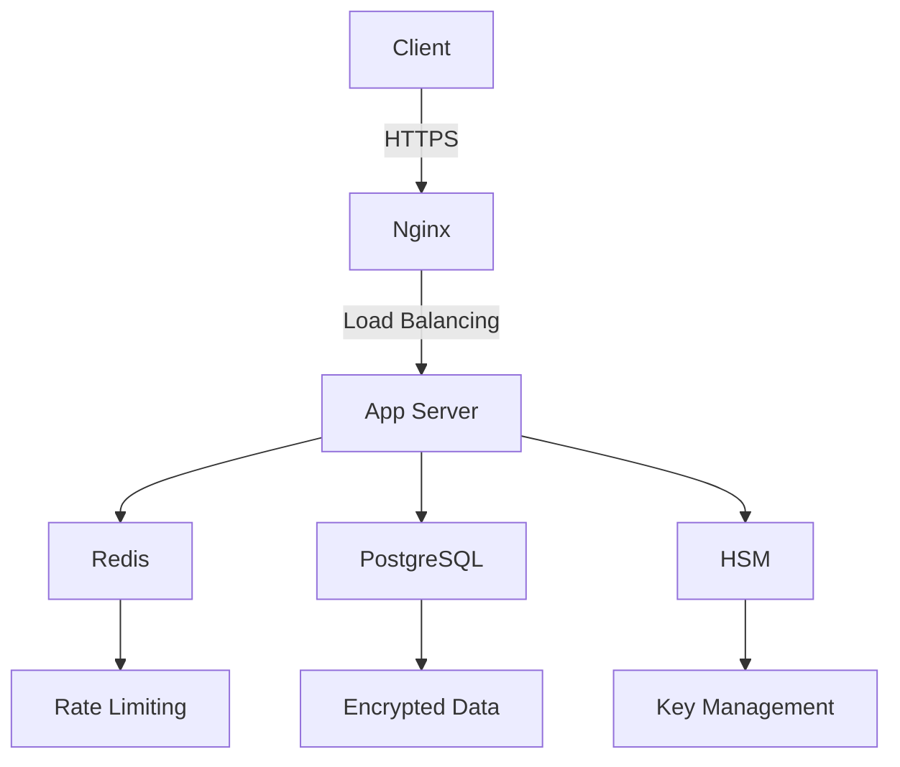

# Secure Banking Application

A full-stack banking application with comprehensive security features built using Python, Flask, and modern web technologies.

## Security Features

### Authentication & Authorization
- JWT-based authentication with 15-minute expiration
- Multi-factor authentication support
- Role-based access control
- Password complexity enforcement (12+ chars, special chars)
- Account lockout after 5 failed attempts
- Secure password hashing with bcrypt

### Data Protection
- End-to-end encryption for sensitive data
- Database encryption at rest
- Field-level encryption for PII
- Secure session management
- Automatic HTTPS redirection

### API Security
- Rate limiting (200/day, 50/hour per IP)
- CSRF protection
- Input sanitization
- Request validation
- SQL injection prevention

### Frontend Security
- Content Security Policy (CSP)
- XSS protection headers
- Secure cookie settings
- Password strength meter
- Session timeout

## Installation

1. Clone the repository:
```bash
git clone https://github.com/your-repo/banking-app.git
cd banking-app
```

2. Set up the environment:
```bash
chmod +x run.sh
./run.sh
```

3. Access the application:
- Frontend: https://localhost:8000
- API Docs: https://localhost:8000/docs

## Security Best Practices

### Development
- Never commit secrets to version control
- Use `bandit` and `safety` for security scanning
- Implement all security headers
- Validate all user input

### Production
- Use a proper certificate authority (not self-signed)
- Enable HSTS with preload
- Implement WAF (Web Application Firewall)
- Regular security audits
- Automated vulnerability scanning

## Architecture



## Security Testing

Run the following commands to test security:

```bash
# Static code analysis
bandit -r backend/

# Dependency checking
safety check

# Run tests
pytest tests/security/
```

## License

This project is licensed under the [Secure Banking License](LICENSE) with additional security requirements.